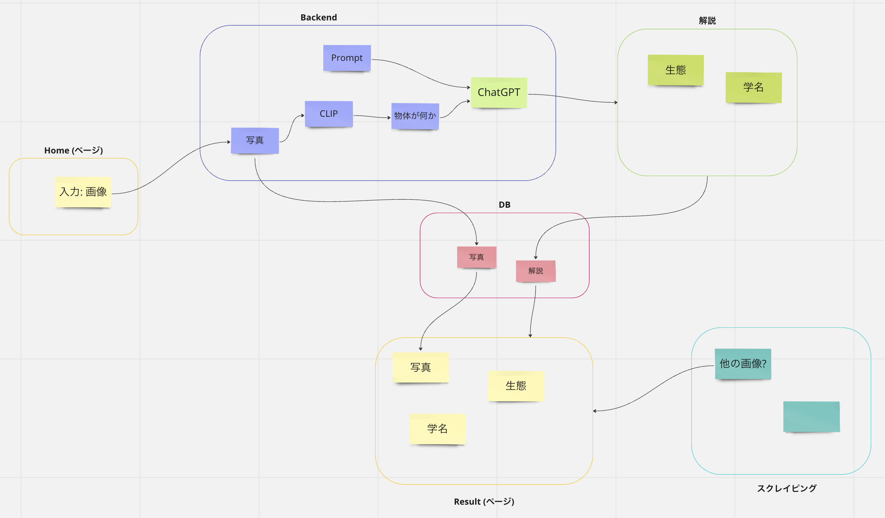

## 概要



## やること
- 一回devをmasterにマージしたい
- 過去の実行をリスト表示
- マイグレーションのロールバックを試しとく
- ログイン機能?
- スライド作成
- webページを綺麗に
- プロンプト検討
- 画像分類モデルの検討

### Template
- レイアウト
- インターフェース
- React design

### View
- 写真->CLIP->Text
- Text->ChatGPT->progres
- Text間のインターフェース
- MVTの機能

### Model
- 何を返す?

### 話題提供
- 豆知識
    - 複数

- 生態
    - 何食べる?
    - どこに住んでる?

## 環境設定
## .envファイルの作成
- .env.exampleを複製して.envという名前に変える
- POSTGRESという名前がついた環境変数はすべてpostgresという名前に設定する
- SECRET_KEYを設定する

## SECRET_KEYを生成する方法
```
>>> from django.core.management.utils import get_random_secret_key
>>> get_random_secret_key()
```

生成した文字列を.envの
DJANGO_SECRET_KEY="django-insecure-"
の -django-insecure- の後ろにくっつける

## 参考
- ChatGPT PlayGround, 
https://platform.openai.com/playground

- ChatGPT role
https://blog.since2020.jp/ai/chatgpt_api_role/

- ChatGPT APIアクセス
https://dev.classmethod.jp/articles/openai-api-chat-python-first-step/